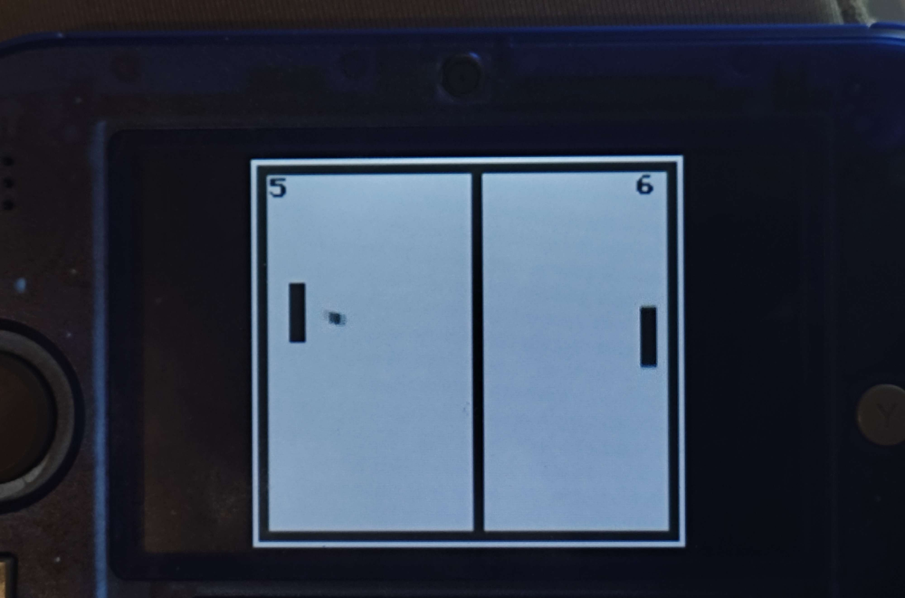

# Game Boy Pong

A classic Pong game recreated for the original Nintendo Game Boy. Written in C and built using [GBDK](https://github.com/gbdk-2020/gbdk-2020), this project brings retro gaming to life with a minimalist twist.

<p align="center">
  
</p>

## Getting Started

### Requirements

- [GBDK (Game Boy Development Kit)](https://github.com/gbdk-2020/gbdk-2020)
- A Game Boy emulator like **BGB**, **SameBoy**, or a real Game Boy + flasher

## Building the Game
### Windows

1. **Install GBDK**  
   Download and extract [GBDK](https://github.com/gbdk-2020/gbdk-2020/releases) to a folder, e.g., `C:\gbdk`.

2. **Compile the Game**  
   A build script is included for Windows users: `make.bat`.

   #### make.bat contents:
   ```bat
    c:\gbdk\bin\lcc -Wa-l -Wl-m -Wl-j -DUSE_SFR_FOR_REG -c -o main.o main.c
    c:\gbdk\bin\lcc -Wa-l -Wl-m -Wl-j -DUSE_SFR_FOR_REG -o main.gb main.o

## 📦 Play or Download

You can also download the ROM or leave feedback on **Game Jolt**:

[](https://gamejolt.com/games/pong_gameboy/502976)
